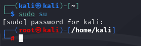
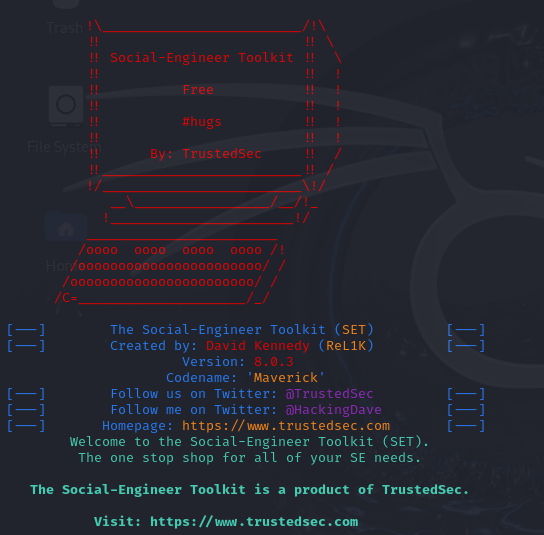
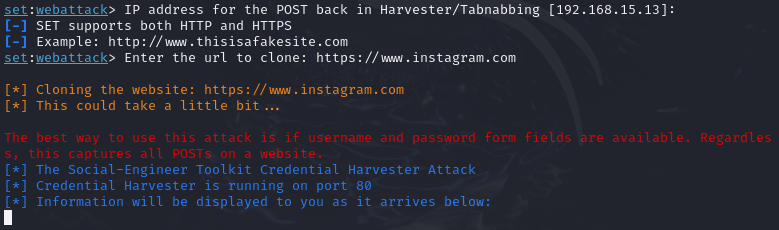
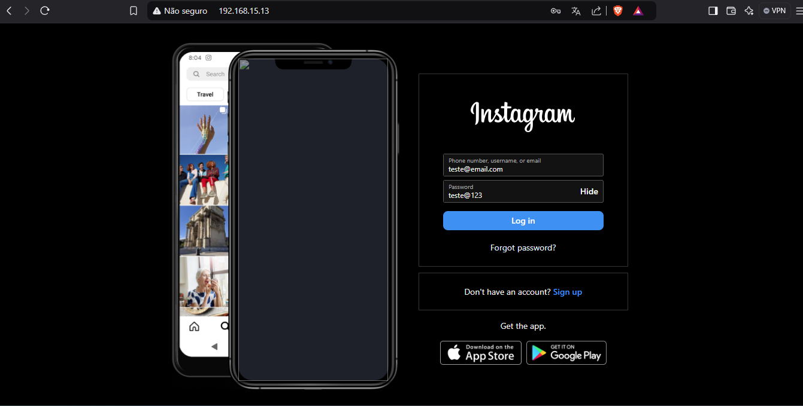
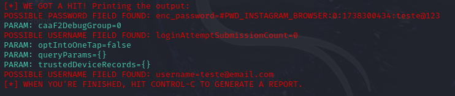

> Repositório criado para o desafio de phishing com Kali Linux proposto pelo Bootcamp Cibersegurança Santander #2.

---

# Phishing para captura de senhas

Para este desafio, irei utilizar o SO **Kali Linux** e a ferramenta **setoolkit**.

## Primeiro passo - obtendo privilégios de superusuário

No terminal, utilizo o comando `sudo su`, escalei os privilégios para *superuser*.

## Segundo passo - utilizando o setoolkit

Agora, com os privilégios obtidos, executo o `setoolkit`.

## Terceiro passo - escolhendo o método de ataque

Dentro do `setoolkit`, eu navego entre as opções:

1. Social-Engineering Attacks - para acessar a sessão de ferramentas para ataques de engenharia social;
2. Web Site Attack Vectors - para selecionar um método de ataque baseados em websites;
3. Credential Harvester Attack Method - para clonar um site e coletar as credenciais inseridas pelo alvo;
4. Site Cloner - para clonar um site existente que servirá como armadilha;

Agora, com a ferramenta rodando, defino o site `https://www.instagram.com` para ser clonado.
O site é então clonado e agora é possível acessá-lo pelo navegador ao inserir o IP indicado.

## Quarto passo - o teste

Com a ferramenta funcionando, acesso o site clonado pelo navegador, preenchendo os seguintes campos:

Usuário: `teste@email.com`

Senha: `teste@123`

No mesmo momento em que acesso o site, a ferramenta detecta meu acesso.

## Resultado - credenciais obtidas

Ao retornar à ferramenta, as credenciais já foram coletadas, como é possível reparar pelas linhas "POSSIBLE PASSWORD FIELD FOUND" e "POSSIBLE USERNAME FIELD FOUND".

